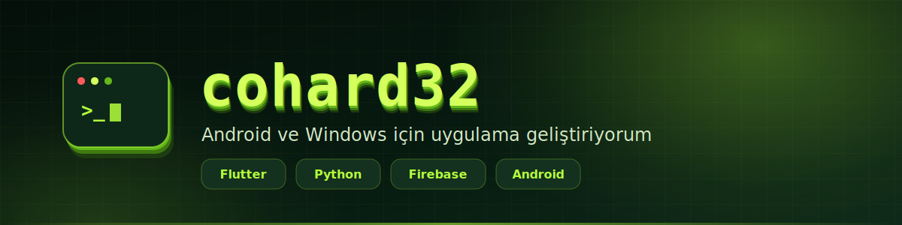

 

---

Gerçekten kullanılan uygulamalar yazıyorum — demo değil, her gün açılan şeyler.
İki alanda çalışıyorum: **Flutter ile Android** ve **Python ile Windows masaüstü**.

---

## Projeler

<table>
<tr>
<td width="50%" valign="top">

### 📱 ROY MESSANGER

Reklamsız, takipsiz, aile içi kullanım için yazılmış bir Android mesajlaşma uygulaması.

Sesli/görüntülü arama, kilit ekranında gelen arama, orijinal kalitede medya paylaşımı, QR ile arkadaş ekleme, uygulama içi otomatik güncelleme.

`Flutter` `Firebase` `Agora RTC`

Sunucu tarafı kod yok — tamamen Firebase'in ücretsiz planında çalışacak şekilde tasarlandı. Veri erişimi Firestore kurallarıyla korunuyor ve **51 senaryoluk** bir test paketiyle sınanıyor.

[**→ Depoyu gör**](https://github.com/cohard32/kardes_mesaj) · [**APK indir**](https://github.com/cohard32/kardes_mesaj/releases/latest)

</td>
<td width="50%" valign="top">

### 🖥️ Welat Net Tools

YouTube, TikTok, Instagram ve X gibi platformlardan video/ses indirme, dönüştürme ve kırpma yapan Windows masaüstü uygulaması.

Ayrıca Word için AI destekli belge araçları ve arka plan kaldırma içeriyor.

`Python` `Windows`

Otomatik hata raporlama ve sürüm güncelleme altyapısıyla birlikte dağıtılıyor.

[**→ Sürümler**](https://github.com/cohard32/welat-net-tools-releases) · [**İndir**](https://github.com/cohard32/welat-net-tools-releases/releases/latest)

</td>
</tr>
</table>

---

## Nasıl çalışırım

<table>
<tr><td width="34%">

**Kök nedeni bulurum**

Belirtiyi bastırmak yerine sebebi ararım. Bir hata düzeldiyse *neden* düzeldiğini de bilirim.

</td><td width="33%">

**Kanıtla ilerlerim**

"Çalışıyor" demek yetmez. Test, ölçüm ya da gerçek cihaz kaydı olmadan bitti saymam.

</td><td width="33%">

**Kararı koda yazarım**

Zor kazanılmış bilgi yorumda kalır — böylece aynı hata altı ay sonra tekrar yapılmaz.

</td></tr>
</table>

---

---

Kod yazmayı seviyorum, kullanılmayan kodu değil.

